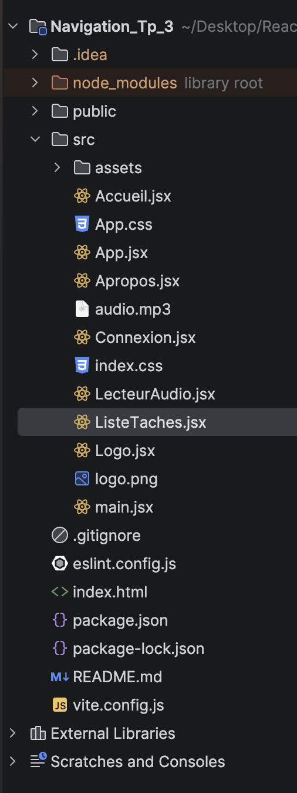
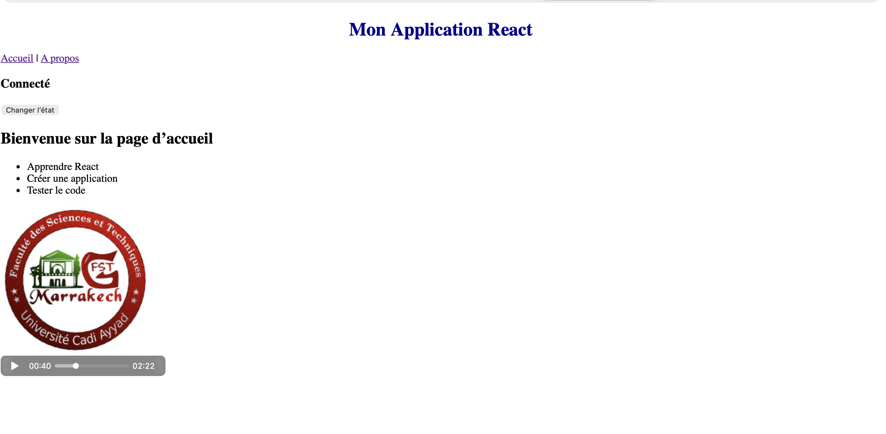
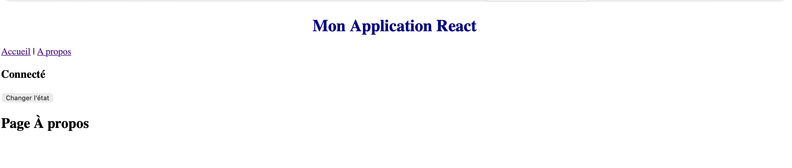

# React — Navigation, Rendu conditionnel & Médias

Un travail d'introduction à React couvrant les fondamentaux de la navigation, du rendu dynamique et de l'intégration de médias.

---

## 🎯 Objectifs pédagogiques

Ce repository couvre les compétences suivantes :

- **React Router** — configurer la navigation interne entre les pages d'une application
- **Rendu conditionnel** — afficher ou masquer des éléments selon l'état de l'application
- **Itération avec `map()`** — générer des listes dynamiques à partir de tableaux de données
- **Médias & styles** — intégrer des images, des vidéos et appliquer des feuilles de style CSS

---

## 📁 Structure du projet

---

## 📚 Concepts abordés

### React Router

Configuration de la navigation avec `react-router-dom` :

### Rendu conditionnel

Affichage d'éléments selon une condition :

---

### Affichage Accueil

---

### Affichage A propos

---

## 🛠️ Technologies utilisées

| Technologie       | Version | Usage             |
|-------------------|---------|-------------------|
| React             | 18+     | Bibliothèque UI   |
| React Router DOM   | 6+      | Navigation        |
| Vite              | 5+      | Bundler / serveur de dev |
| CSS               | —       | Stylisation       |

---